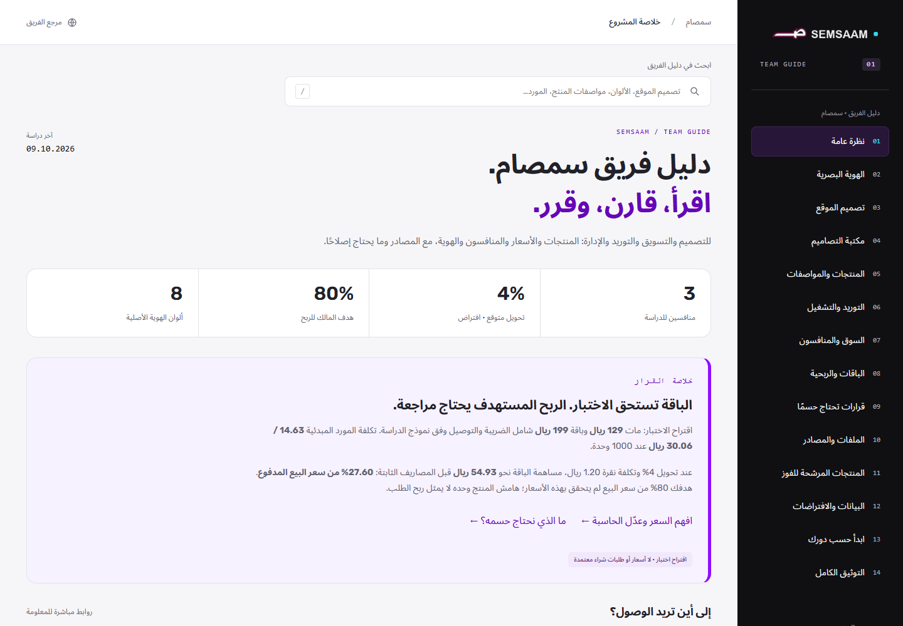

# دليل فريق سمصام · Team Guide

**خاص — للحسابات التي يضيفها المالك فقط.** هذا المستودع يحفظ ملفات الموقع الجاهزة. [افتح دليل الفريق الخاص](https://semsaam-knowledge-base.ahmadsabbah81.chatgpt.site/#overview). يحتاج الدخول بحساب مصرح في الموقع؛ صلاحية GitHub وحدها لا تمنح صلاحية الموقع. GitHub Pages العام معطّل.

يتضمن الموقع 14 قسمًا و15 وثيقة: خلاصة المشروع، الهوية والتصاميم، المنتجات والمواصفات، الموردون والتشغيل، المنافسون، الباقات وحاسبة الربحية، مرشحو الفوز، البيانات، القرارات، دليل الموظفين والتوثيق الكامل.

[المصدر الخاص القابل للتعديل](https://github.com/AhmadS-cell/semsaam-knowledge-base) · [المنافسون والأسعار](https://github.com/AhmadS-cell/semsaam-knowledge-base/blob/main/knowledge-base/deskmat-market-2026-10-09.md) · [الهوية](https://github.com/AhmadS-cell/semsaam-knowledge-base/blob/main/knowledge-base/brand.md) · [القرارات](https://github.com/AhmadS-cell/semsaam-knowledge-base/blob/main/knowledge-base/open-decisions.md)

الواجهة الكاملة منشورة على الاستضافة الخاصة الموجودة، والملفات والتعديلات محفوظة في GitHub الخاص. صاحب المشروع يختار من يدعوهم؛ حماية الدخول تشمل جميع الصفحات والملفات. يمكن أيضًا تنزيل الملفات وتشغيلها محليًا للمراجعة.
